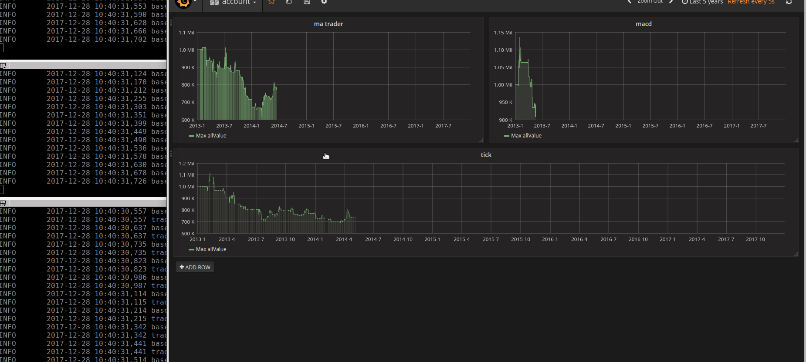
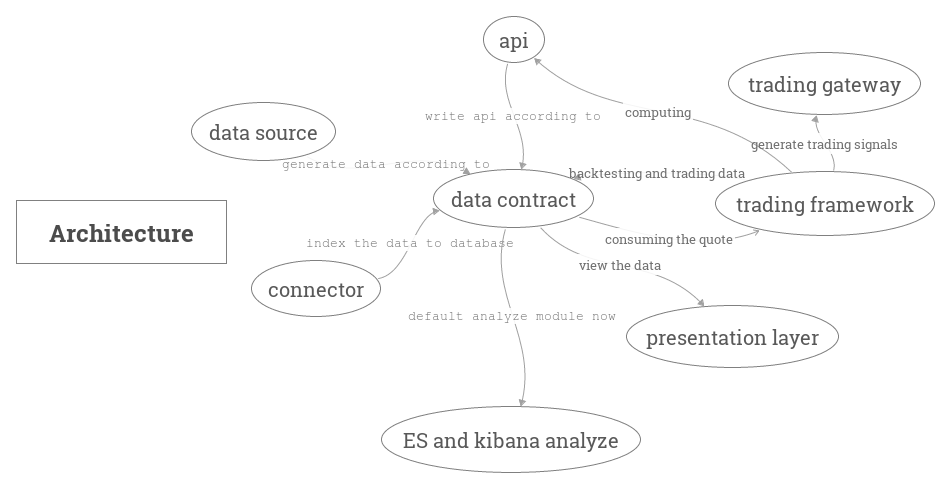

[](https://travis-ci.org/foolcage/fooltrader)

## This project is deprecated, please move on to the new project [https://github.com/zvtvz/zvt](https://github.com/zvtvz/zvt)

**Read this in other languages: [中文](README.md).**  
# fooltrader:trade as a fool
>"To survive in the market, you must stay away from being smart because your intelligence is worthless in the market"------zen in chaos

# 1. Screenshots
## 1.1 **China stock fundamentals analysis**  

>Enter the stocks you are interested in to see the relationship between their net profit and the stock price, maybe you will not think that the "fundamental" useless?  
For example: Vanke's profit has been growing rapidly, but cabbage price pressure for several years, so 'barbarians' came...  
And you could calculate the entire market stocks using fooltrader, and automatically notify you, in fact, is not that difficult.  

## 1.2 **USA stock fundamentals analysis**  

>Take a look at the performance of US stocks how? The operation is uniform.   

## 1.3 **Back test**  
You could write the Strategy using  event-driven or time walk way, and view and analyze the performance in uniform way.  
See the [*design doc*](./docs/trader.md)  
```python
class EventTrader(Trader):
    def on_init(self):
        self.trader_id = 'aa'
        self.only_event_mode = True
        self.universe = ['stock_sz_000338']
        self.df_map = {}

    def on_day_bar(self, bar_item):
        current_security = bar_item['securityId']
        current_df = self.df_map.get(current_security, pd.DataFrame())
        if current_df.empty:
            self.df_map[current_security] = current_df

        current_df = current_df.append(bar_item, ignore_index=True)
        self.df_map[current_security] = current_df

        if len(current_df.index) == 10:
            ma5 = np.mean(current_df.loc[5:, 'close'])
            ma10 = np.mean(current_df.loc[:, 'close'])
            # buy when ma5 > ma10
            if ma5 > ma10 and not self.account_service.get_position(current_security):
                self.buy(security_id=current_security, current_price=bar_item['close'])
            # buy when ma5 < ma10
            elif ma5 < ma10 and self.account_service.get_position(current_security):
                self.sell(security_id=current_security, current_price=bar_item['close'])
            current_df = current_df.loc[1:, ]
            self.df_map[current_security] = current_df
```

Running strategy can view the results in real time, and make further assessment  


## 1.4 **General trend dashboard**
  

## 1.5 **gdp and market value comparison**
  
>As long as the total market capitalization is close to GDP, it is basically the top.   
And From another perspective look,the total market capitalization is impossible always far below GDP.  

## 1.6 **GEM(similar to nasdaq) PE analysis**

>17.94% of the time in 20-40, 50.7% of the time in the 40-70, 26.67% of the time in the 70-100, 4.69% of the time in 100 or more.  
So thinking about gemp PE about 40 or so "Valuation" high and bearish it, doomed to not enjoy the 2015-year GEM bull market  

## 1.7 **Global market PE comparison**  

>GEM>small board>shenzhen>S & P>SSE?Maybe need a little imagination, the style is also convertible?  
Well, the average PE of S & P has also exceeded 120, which is still slightly lower than that of our big GEM.  
Now,the PE of the SSE is actually lower than that of the S & P, so?  

# 2. Introduction
fooltrader is a Quantitative Trading System designed with **big data** technology to capture, clean, structure, calculate, display, backtesting and trading.   
Its goal is to provide a unified framework for conducting research, backtesting, forecasting, and trading on * entire markets * (equities, futures, bonds, foreign exchange, digital currencies, macroeconomics, etc.)  
Suitable for: ***Quantitative traders, financial professionals, people who are interested in economic data, programmers, people who like freedom and exploration***  

# 3. Architecture diagram
fooltrader is a well-structured modular system that you can use at different levels, as well as extend, transform, or replace the modules inside.  



# 4. use step by step
The hierarchy of usage is one-to-one with the modules in the architecture diagram.  
You can stop at any step, expand or replace with your own familiar system.  
Of course, I still hope that you will run all the way, because the technical selection of each module here has been carefully considered, and the system is in active developing.  

### 4.1 Environment preparation  
OS:Ubuntu 16.04.3 LTS  
In principle, the system-specific components are cross-platform, but I only test on ubuntu and mac  
Memory:>16G  
Disk:The bigger the better  
clone or fork the code    
```bash
$ git clone https://github.com/foolcage/fooltrader.git
```
### 4.2 init python env
```bash
$ cd fooltrader
$ ./init_env.sh
```

if you could see:  
```bash
Requirements installed.  
env ok
```
Congratulation! Now you could play with fooltrader  
### 4.3 crawl the data  
```bash
$ source ve/bin/activate
$ ./ve/bin/ipython
In [1]: from fooltrader.datamanager import datamanager
#crawl stock meta data
In [2]: datamanager.crawl_stock_meta()
#crawl index data
In [3]: datamanager.crawl_index_quote()
#crawl stock kdata and tick data
In [4]: datamanager.crawl_stock_quote(start_code='002797',end_code='002798',crawl_tick=False)
#crawl finance data
In [5]: datamanager.crawl_finance_data(start_code='002797',end_code='002798')
```
crawling data and the api is in different module:  
>spiders focus on crawling things: speed of crawling, better data classification, data completion, handling ban, etc.
> api design only depends on [*data contract*](./docs/contract.md), which has better speed and flexibility

You can also download packaged historical data[*data.zip*](https://pan.baidu.com/s/1dmZaPo).
And you need only crawl the incremental data:
```bash
$ ./sched_finance.sh
```
```bash
$ ./sched_quote.sh
```
The script periodically fetches "missing" data. After the historical data integrity check is passed, it just actually fetches the data of the day, so that we have a complete data source for automated self-maintenance.  
Scheduled tasks can be configured in the sched_quote.py file:  
You could set the
```python
@sched.scheduled_job('cron', hour=17, minute=00)
def scheduled_job1():
    crawl_stock_quote('000001', '002999')
    crawl_index_quote()


@sched.scheduled_job('cron', hour=17, minute=20)
def scheduled_job2():
    crawl_stock_quote('300000', '300999')


@sched.scheduled_job('cron', hour=17, minute=40)
def scheduled_job3():
    crawl_stock_quote('600000', '666666')
```

Finally, how to use the data crawled? Please refer to[*data contract*](./docs/contract.md)  
And here, you could use your familiar system to anylyze the data,e.g,mysql,superset,redash,hadoop.  
Just follow the data contract and write the connector, and I hope you could pr to me.  
### 4.4 install elastic-search and kibana(6.1.1)  
>Just change the storage of the data, incredible change to the system happen.  

follow the official docs:https://www.elastic.co/guide/en/elastic-stack/current/installing-elastic-stack.html  
or:  
```bash
$ wget https://artifacts.elastic.co/downloads/packs/x-pack/x-pack-6.1.1.zip
$ wget https://artifacts.elastic.co/downloads/elasticsearch/elasticsearch-6.1.1.zip
$ unzip elasticsearch-6.1.1.zip
$ cd elasticsearch-6.1.1/
$ bin/elasticsearch-plugin install file:///path/to/file/x-pack-6.1.1.zip
$ cp ../fooltrader/config/elasticsearch.yml config/
$ ES_JAVA_OPTS="-Xms8g -Xmx8g"  ./bin/elasticsearch
$
$ wget https://artifacts.elastic.co/downloads/kibana/kibana-6.1.1-linux-x86_64.tar.gz
$ tar -xzf kibana-6.1.1-linux-x86_64.tar.gz
$ cd kibana-6.1.1-linux-x86_64/
$ bin/kibana-plugin install file:///path/to/file/x-pack-6.1.1.zip
$ cp ../fooltrader/config/kibana.yml config/
$ ./bin/kibana
```

### 4.5 use es_connector to store the data to elastic-search  
in the fooltrader ipython env  
```bash
In [1]: from fooltrader.connector import es_connector
#stock meta->es
In [2]: es_connector.stock_meta_to_es()
#index data->es
In [3]: es_connector.index_kdata_to_es()
#stock kdata->es
In [4]: es_connector.stock_kdata_to_es()
#you could open several terminals to improve the index speed
In [4]: es_connector.stock_kdata_to_es(start='002000',end='002999')
#finance data->es
In [5]: es_connector.balance_sheet_to_es()
In [5]: es_connector.income_statement_to_es()
In [5]: es_connector.cash_flow_statement_to_es()
```

Then, let's briefly enjoy its power  
Query the top 5 net profit of the interim report 2017  
```bash
curl -XPOST 'localhost:9200/income_statement/doc/_search?pretty&filter_path=hits.hits._source' -H 'Content-Type: application/json' -d'
{
  "query": {
    "range": {
      "reportDate": {
        "gte": "20170630",
        "lte": "20170630"
      }
    }
  },
  "size": 5,
  "sort": [
    {
      "netProfit": {
        "order": "desc"
      }
    }
  ]
}
'
{
  "hits": {
    "hits": [
      {
        "_source": {
          "exchangeGains": 1.3242E10,
          "netProfit": 1.827E9,
          "securityId": "stock_sh_601318",
          "investmentIncome": 2.0523E10,
          "operatingProfit": 7.8107E10,
          "accumulatedOtherComprehensiveIncome": 2.0E8,
          "attributableToMinorityShareholders": 6.5548E10,
          "sellingExpenses": 1.0777E10,
          "investmentIncomeFromRelatedEnterpriseAndJointlyOperating": "398259000000.00",
          "id": "stock_sh_601318_20170630",
          "minorityInterestIncome": 6.238E10,
          "code": "601318",
          "otherComprehensiveIncome": 6.5506E10,
          "nonOperatingIncome": 4.006E9,
          "financingExpenses": 0.0,
          "reportEventDate": "2017-08-18",
          "netProfitAttributedToParentCompanyOwner": 5.778E10,
          "disposalLossOnNonCurrentLiability": 9.01E8,
          "incomeFromChangesInFairValue": -2.56E8,
          "incomeTaxExpense": 2.2E7,
          "operatingTotalCosts": 3.4139E11,
          "assetsDevaluation": 8.75E8,
          "EPS": 1.9449E10,
          "operatingCosts": 9.4E7,
          "attributableToOwnersOfParentCompany": 1.58E8,
          "ManagingCosts": 6.402E10,
          "totalProfits": 8.403E9,
          "dilutedEPS": 2.4575E10,
          "reportDate": "20170630",
          "businessTaxesAndSurcharges": 9.442E9,
          "operatingRevenue": 4.63765E11,
          "nonOperatingExpenditure": 1.35892E11
        }
      ]
    }
  }
}
```
In fact we have the REST API naturally and could use your favourite language to anylyze.
Just follow the [*data contract*](./docs/contract.md) and ES DSL.  

### 4.6 Use kibana to anylyze
(TBD)

### 4.7 Backtesting
(TBD)

### 4.8 Trading
(TBD)

# TODO
* Trading DSL design
* WEB management interface, wizard-generated strategy
* Real-time market and kafka real-time calculation
* Integrated vnpy trading interface
* Futures data capture
* Hong Kong stock data capture

# Contact information
QQ group:300911873  
if you like this project,please star it and tell me your github user name when joining the qq group  
check http://www.imqq.com/html/FAQ_en/html/Discussions_3.html
