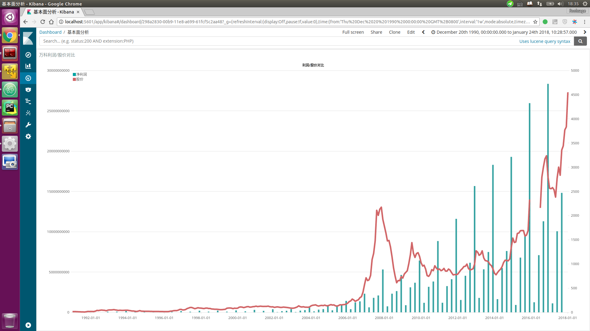

# fooltrader:trade as a fool
>"要在市场上生存，就必须远离聪明，因为，你的聪明在市场面前一钱不值"------缠中说禅  

# 使用截图

**大势dashboard**
  

**gdp市值比较**
  
>只要总市值接近GDP,基本就是顶部,而长期远离GDP也是不可能的.

**创业板PE分析**

>17.94%的时间处于20-40,50.7%时间处于40-70,26.67%的时间处于70-100,4.69%的时间处于100以上.
所以:在40左右就觉得"估值"高,看空创业板的,注定无法享受15年的创业板大牛市

**各市场PE对比**

>创业板>中小板>深证>上证?也许需要一点想象力,风格也是可以转换的?

**个股分析**

>万科的利润一直在高速增长,白菜价压了几年,所以'野蛮人'来了,还有类似的标的吗?  
>数据,工具都准备好了,只要你能想到,就能做到,你想不到的,'机器'也能学习到.

**回测**

>多策略实时运行,实时监控.由于我对目前的回测框架还不是很满意,先不多介绍  
>后面会使用DSL和插件的方式来驱动,并提供web向导生成策略和调参,以及评估,
>最后,机器学习也会上.

# 简介
fooltrader是一个利用大数据技术设计的量化交易系统,包括数据的抓取,清洗,结构化,计算,展示,以及一个回测和交易框架.
相比其他系统有以下一些特点:  
* 统一  
股票,期货,债券,数字货币等在整个系统里面都是一等公民,有其唯一的编号,使用一致的存储和计算方法  
* 正交  
对"原料"数据和生成数据加以区分,从而使得数据精简并有无限的灵活性.
比如tick是原料,各级别k线是生成数据;财务三张表是原料,PE,PB,ROE等是生成数据.
* 适当冗余  
对于非常常用的生成数据直接存储.  
* 无限的扩展性  
可以使用集群的方式进行存储和计算,应付全市场分析和交易的复杂性.  

# 支持的功能
* 爬虫代理框架  

>可配置代理服务器池和并发数,从而提高爬虫的健壮性

* 数据抓取  
  * A股标的信息抓取  
  * A股tick数据抓取  
  * A股日线数据抓取  
  * A股财务数据抓取  
  * A股事件抓取  

>数据的处理方式是,先定义[*数据协议*](./docs/design.md),再寻找数据源,这样做的好处是:数据协议的稳定为整个系统的稳定打下坚实的基础,多数据源比较提高数据准确性,多数据源聚合提高数据完整性.

* 常用技术指标计算(ma,ema,macd等)

>我们不需要那么多技术指标,但一定要知道所使用指标的内涵,所以,我们选择自己计算;没错,由于数据的统一性,理所当然地,计算的统一性也有了.
不管是A股,港股,还是数字货币,不管是1分钟级别,还是日线,使用的都是统一的api.

* 回测框架

>小金属涨疯了,但相关的上市公司股价还在历史新低,我是不是可以买一点?  
金叉买,死叉卖,在不同级别上表现如何?在不同标的上表现如何?  
相同的策略,如何快速的在所有标的上回测,并进行对比?  
利润增长,股价也增长?或者提前反映?滞后反映?各种表现的比例如何?  
各个策略之间如何通信,从而形成合力?  
#### 没错:回测框架必须要考虑这些问题  

# 环境准备
* 系统  
操作系统:Ubuntu 16.04.3 LTS(原则上,其他也可以,系统使用的组件都是跨平台的)  
内存:>16G  
硬盘:越大越好  

* 组件安装  
  * python
  如果你是使用ubuntu的话,原则上执行以下命令,python环境就好了:  
  ```bash
  $ git clone https://github.com/foolcage/fooltrader.git
  $ cd fooltrader
  $ ./init_env.sh
  ```
  * elastic-search and kibana(6.1.1)  
  可以参考官方文档进行安装:https://www.elastic.co/guide/en/elastic-stack/current/installing-elastic-stack.html  
  也可以用以下命令来完成:  
  ```bash
  $ #下载xpack
  $ wget https://artifacts.elastic.co/downloads/packs/x-pack/x-pack-6.1.1.zip
  $ #下载es
  $ wget https://artifacts.elastic.co/downloads/elasticsearch/elasticsearch-6.1.1.zip
  $ unzip elasticsearch-6.1.1.zip
  $ cd elasticsearch-6.1.1/
  $ #为es安装xpcck插件,就是刚刚下载的那个x-pack-6.1.1.zip,格式为file://+其路径
  $ bin/elasticsearch-plugin install file:///path/to/file/x-pack-6.1.1.zip
  $ #用fooltrader中的elasticsearch.yml覆盖es默认配置
  $ cp ../fooltrader/config/elasticsearch.yml config/
  $ #启动es,可根据自己的情况更改heap大小,<=32g
  $ ES_JAVA_OPTS="-Xms8g -Xmx8g"  ./bin/elasticsearch
  $
  $ #下载kibana
  $ wget https://artifacts.elastic.co/downloads/kibana/kibana-6.1.1-linux-x86_64.tar.gz
  $ tar -xzf kibana-6.1.1-linux-x86_64.tar.gz
  $ cd kibana-6.1.1-linux-x86_64/
  $ #为kibana安装xpcck插件,就是刚刚下载的那个x-pack-6.1.1.zip,格式为file://+其路径
  $ bin/kibana-plugin install file:///path/to/file/x-pack-6.1.1.zip
  $ #用fooltrader中的kibana.yml覆盖kibana默认配置
  $ cp ../fooltrader/config/kibana.yml config/
  $ ./bin/kibana
  ```

# TODO
* 常用API封装
* 期货数据抓取
* 港股数据抓取
* 美股数据抓取
* 交易DSL设计
* WEB管理界面
