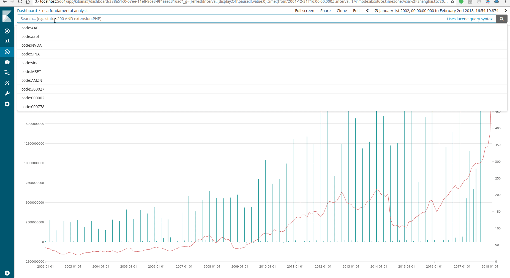
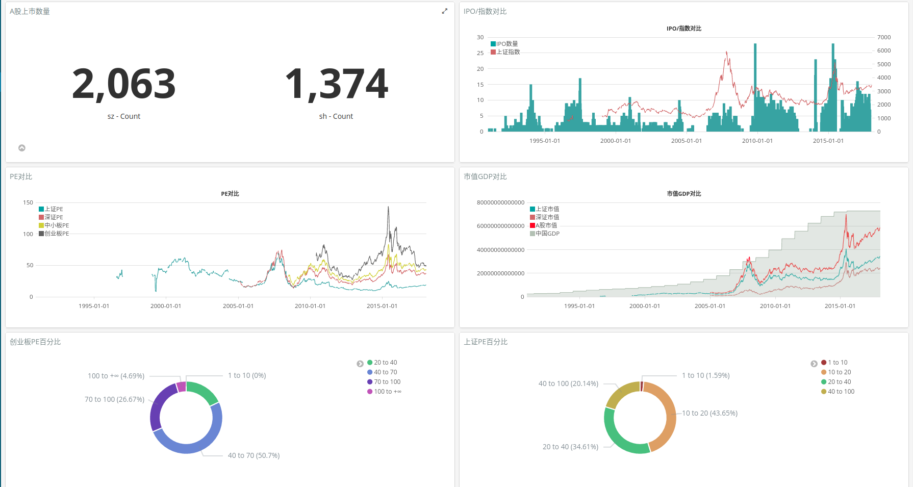
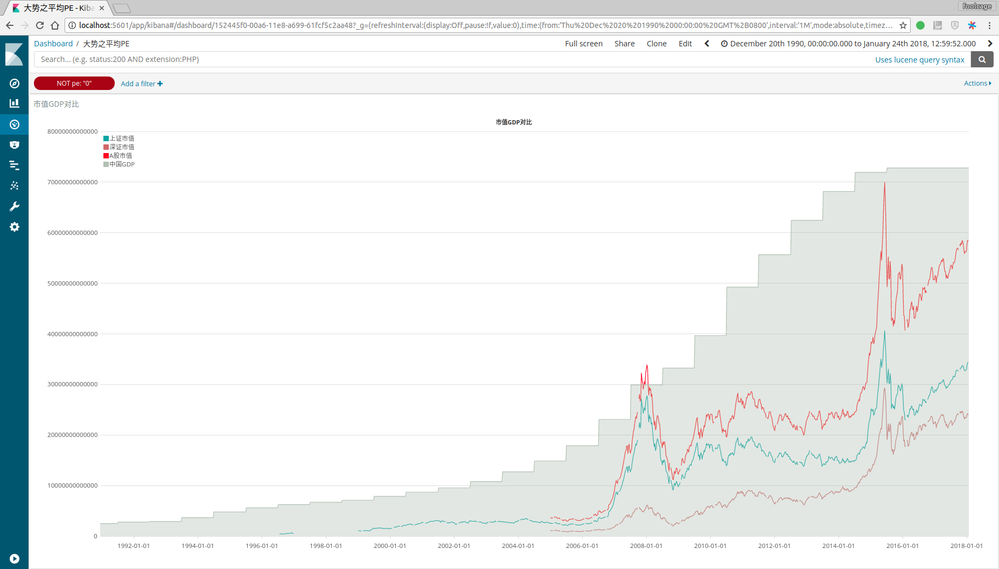
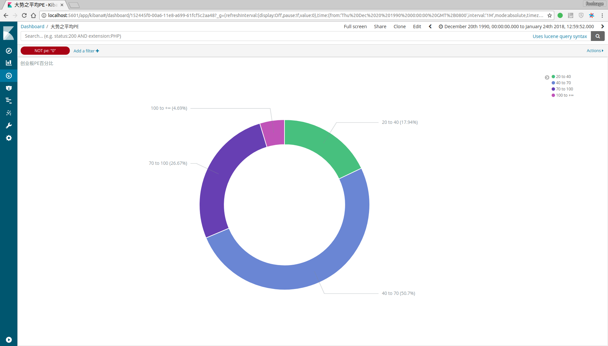
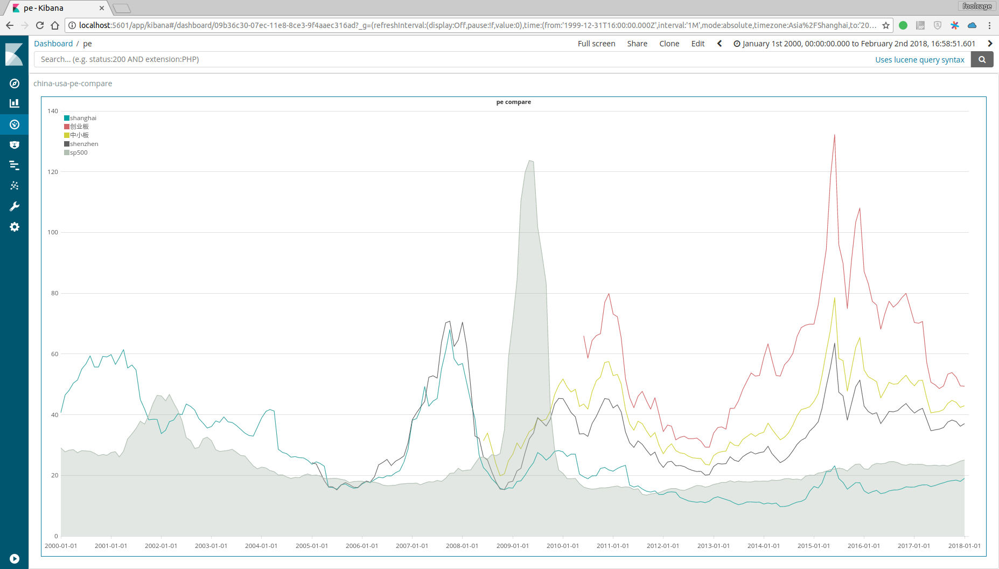

# 1. 使用截图
## 1.1 **A股基本面分析**  

>输入你感兴趣的个股,查看其净利润跟股价的关系,也许你就不会认为"基本表面"没用了?  
比如:万科的利润一直在高速增长,白菜价压了几年,所以'野蛮人'来了,还有类似的标的吗?  
而把全市场的个股进行计算,并自动通知你,其实也不是什么难事.

## 1.2 **美股基本面分析**  

>看一下美股的表现如何呢?  

## 1.3 **大势dashboard**
  

## 1.4 **gdp市值比较**
  
>只要总市值接近GDP,基本就是顶部,而长期远离GDP也是不可能的.

## 1.5 **创业板PE分析**

>17.94%的时间处于20-40,50.7%时间处于40-70,26.67%的时间处于70-100,4.69%的时间处于100以上.
所以:在40左右就觉得"估值"高,看空创业板的,注定无法享受15年的创业板大牛市

## 1.6 **各市场PE对比**  

>创业板>中小板>深证>标普>上证?也许需要一点想象力,风格也是可以转换的?
嗯,标普的平均PE曾经也超过120,比我们的大创业板的疯狂还是差一点,然后,现在我们上证的PE其实是比标普低的,所以?  
